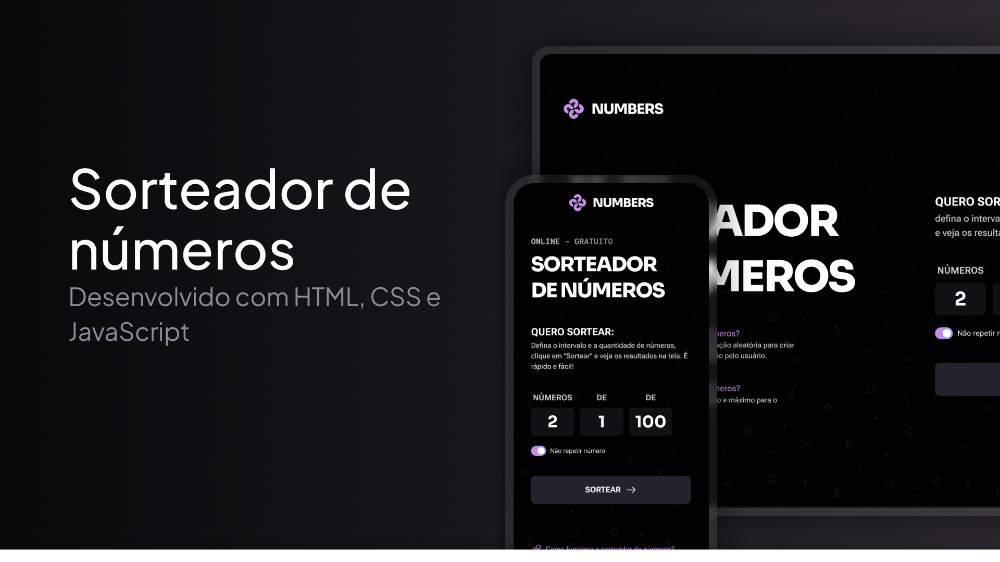

<h1 align="center"> Sorteador de Números </h1>

<p align="center">
Aplicação web responsiva para realizar sorteios de números dentro de um intervalo definido pelo usuário.<br/>
</p>

<p align="center">
  <a href="#projeto">Projeto</a>&nbsp;&nbsp;&nbsp;|&nbsp;&nbsp;&nbsp;
  <a href="#tecnologias-utilizadas">Tecnologias</a>&nbsp;&nbsp;&nbsp;|&nbsp;&nbsp;&nbsp;
  <a href="#funcionalidades">Funcionalidades</a>&nbsp;&nbsp;&nbsp;|&nbsp;&nbsp;&nbsp;
  <a href="#lógica-do-sorteio">Lógica</a>&nbsp;&nbsp;&nbsp;|&nbsp;&nbsp;&nbsp;
  <a href="#responsividade">Responsividade</a>
</p>

<br>

<p align="center">
  
</p>

## Projeto

O Sorteador de Números é uma aplicação web desenvolvida para realizar sorteios a partir de parâmetros definidos pelo usuário.

É possível informar a quantidade de números que serão sorteados, definir o menor e o maior valor do intervalo e escolher se os números podem ou não se repetir.

O projeto foi desenvolvido durante os estudos de desenvolvimento Full Stack, com foco na aplicação prática de HTML, CSS e JavaScript.

Além da construção da interface, o desenvolvimento envolveu validações de formulário, geração de números aleatórios, manipulação de arrays, manipulação do DOM e criação de animações para apresentação dos resultados.

## Projeto online

- [Acesse o projeto finalizado, online](https://felipe-hendrich.github.io/sorteador-numeros/)

## Tecnologias utilizadas

- HTML
- CSS
- JavaScript
- Git
- GitHub
- Google Fonts

## Funcionalidades

- Definição da quantidade de números a serem sorteados
- Definição do valor inicial do intervalo
- Definição do valor final do intervalo
- Opção para permitir ou impedir números repetidos
- Validação dos valores informados
- Validação da quantidade de números disponíveis no intervalo
- Geração de números aleatórios
- Sorteio sem repetição quando selecionado
- Exibição dinâmica dos resultados
- Animação individual dos números sorteados
- Exibição sequencial dos resultados
- Botão para realizar um novo sorteio
- Limpeza dos resultados anteriores
- Mensagens de erro para entradas inválidas
- Interface responsiva para diferentes tamanhos de tela

## Validações

Antes de realizar o sorteio, a aplicação verifica os dados informados pelo usuário.

Entre as validações implementadas estão:

- quantidade de números maior que zero
- quantidade informada como número inteiro
- valores do intervalo como números inteiros
- menor valor não pode ser maior que o maior valor
- quantidade solicitada não pode ultrapassar os números disponíveis no intervalo quando a opção de não repetir estiver ativada

Caso alguma condição não seja atendida, uma mensagem de erro é exibida antes da execução do sorteio.

## Lógica do sorteio

Os números são gerados utilizando os métodos `Math.random()` e `Math.floor()`.

O cálculo considera o menor e o maior valor definidos pelo usuário, permitindo gerar valores dentro de um intervalo inclusivo.

Quando a opção de não repetir números está ativada, cada número gerado é comparado com os valores já armazenados no array de resultados.

Caso o número já exista, ele é descartado e uma nova tentativa é realizada.

O processo continua até que a quantidade solicitada de números seja alcançada.

## Exibição dos resultados

Após a realização do sorteio, o formulário é ocultado e os números são adicionados dinamicamente à página utilizando JavaScript.

Cada resultado é criado com:

- `document.createElement()`
- `textContent`
- `append()`

Os números são exibidos individualmente utilizando `setTimeout()`, criando uma sequência visual entre cada resultado.

Também são utilizados `requestAnimationFrame()` e o evento `animationend` para controlar as animações e exibir o botão de novo sorteio somente após a conclusão da apresentação dos resultados.

## Responsividade

A aplicação foi desenvolvida para se adaptar a diferentes tamanhos de tela.

Foram utilizados Flexbox, media queries e reorganização dos elementos para ajustar:

- estrutura principal da página
- formulário
- campos de entrada
- textos
- resultados
- botões
- espaçamentos

Em telas menores, os conteúdos são reorganizados verticalmente para melhorar a leitura e a utilização do formulário.

Em telas maiores, a aplicação utiliza uma estrutura dividida entre as informações do projeto e a área do sorteio.

## Recursos visuais

O projeto utiliza diferentes interações e animações em CSS, incluindo:

- bordas com gradiente
- animação no botão de sorteio
- animação do ícone do botão
- switch personalizado para ativar ou desativar repetição
- animação dos números sorteados
- transições de escala, rotação e opacidade
- animação no botão de realizar um novo sorteio

## Estrutura de arquivos

```text
sorteador-numeros/
├── index.html
├── global.css
├── index.css
├── script.js
├── .gitignore
├── README.md
│
├── .github/
│   └── capa-readme.png
│
├── assets/
│   ├── bg.png
│   ├── icon-list.svg
│   └── logo-numbers.svg
│
└── styles/
    └── layout.css
```
